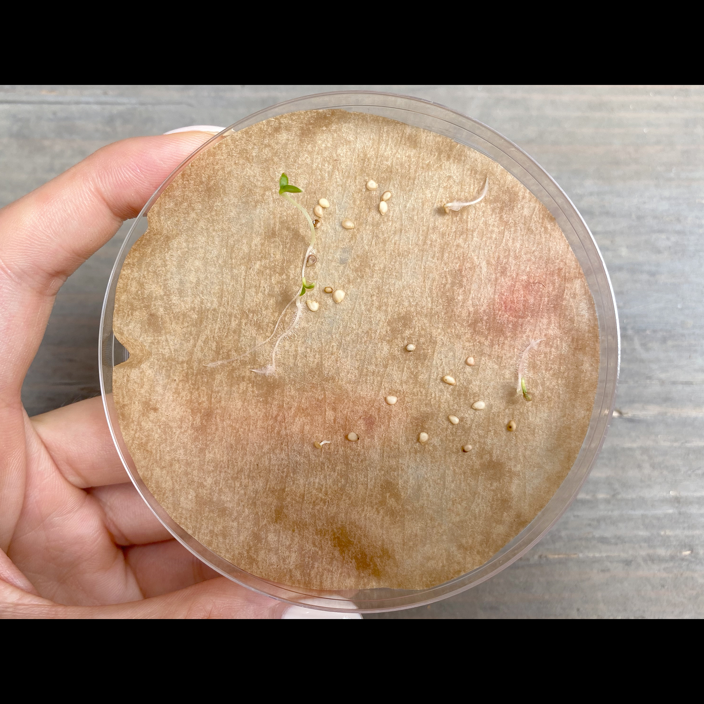
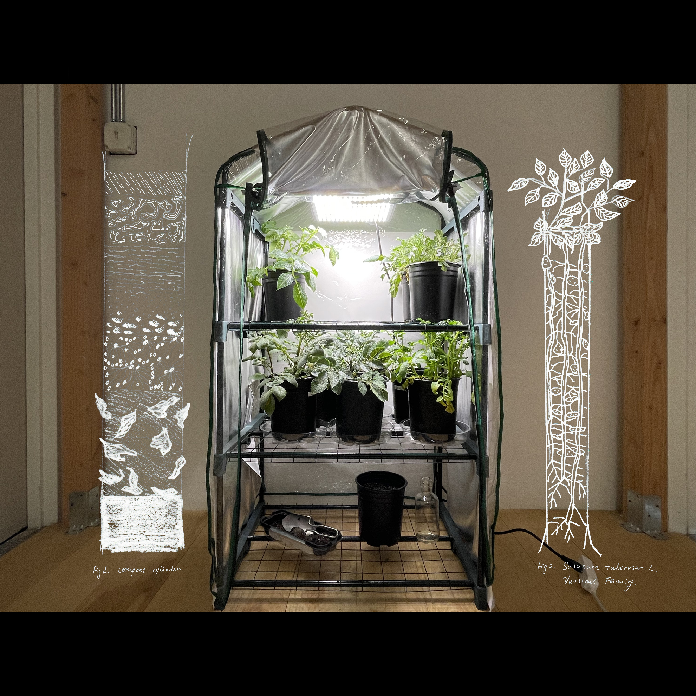

   In the classic horizontal fixation, the land and the ground are intrinsically overlaid. In an earthbound history, the expansion of civilization is to spread its reach over the planetary surface. As humanity sets its sights beyond planet Earth, visions of interplanetary futures take a vertical perspective:  lifting off, leaving the ground, reaching the infinite, arriving at the extra-terrestrial terra nullius — new land. After expansion, escalation becomes the new signature of growth. 

In a year during which airplanes have not taken off much and our mobility is limited, I ask:

    Is the movement towards the future only departure? 
    How can we arrive at the future while also connecting with the ground? 

At the beginning of March 2020, we were lucky enough to launch Unearthing Futures aboard SpaceX CRS-20 to the International Space Station for a month. Inside the payload, there were two hundred and fifty True Potato Seeds (TPS).  

Native to Peru, potatoes are now the fifth most grown crop in the world. Rather than selecting one "engineered-to-perfection" single species, we chose six varieties of Peruvian TPS for the voyage. The seeds completed an approximately twelve million mile journey around the planet in twenty-nine days and forty-eight minutes, and returned to Earth on April 7. Upon their return, we have been germinating the seeds and growing them in New York and Portland alongside their earth-bound siblings. 

In order to tuberize, a potato plant’s vine must generate a sufficient quantity of lateral root system. Growing from a germinated seed, the plant needs light and cannot be buried deep in the soil like the potato eyes with which most of us are familiar. Thus, in order to produce potatoes, the plant has to grow its roots vertically upwards, relying on its caregiver to periodically cover its base with soil and keep new vines largely buried. The plants are slowly stepped up, their leaves never too far from the ground surface. After a few months, our potato plants are now eight to ten inches tall, with six inches underground. 

Taking root is not only downwards, but also upwards. In a way, the path of the potato resonates with that of our societies: building on top of its predecessors. This year, we are much more confined in our local spaces. Rather than longing for the next leap or departure, I suggest we learn from our potato friends: rooting in, hilling up, growing with the land.

### Unearthing Futures is a collaboration between Xin Liu and Lucia Monge 

Two hundred and Fifty Peruvian True Potato Seeds travelled to the International Space Station for a month, with their earth-bound sibling seeds.

Project website: https://www.unearthingfutures.org
