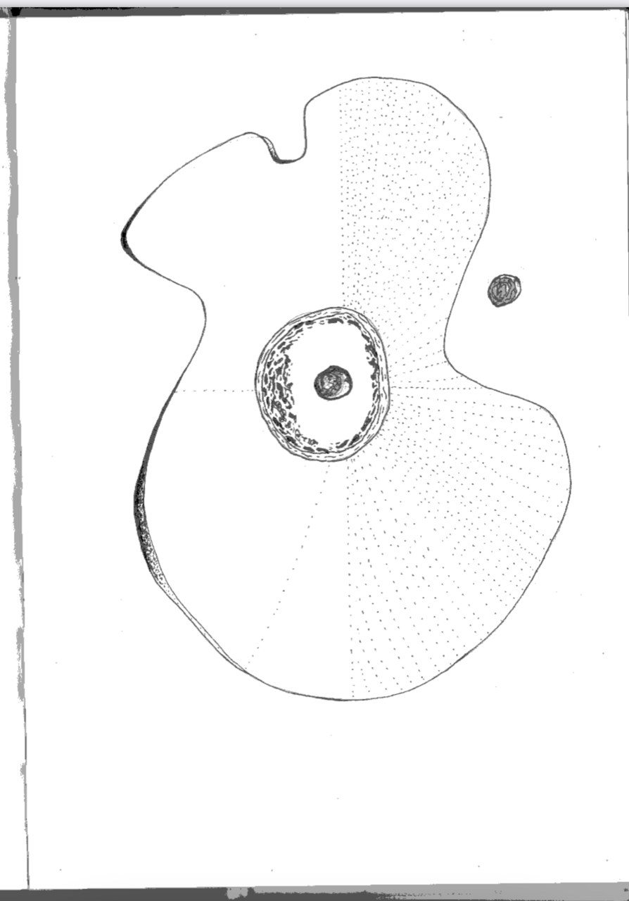

### A project for Summa Technologiae seminar CONSTRUCTING TIME, REINVENTING NATURE with e-flux, By Cássio Figueiredo, Virgilio A. Rivas and Xin Liu

In the moment we encounter the black box, our point of view is predetermined. There are several possibilities:

1. We are outside the black box and the box is an independent entity of which the edges are also visible. This is a classic relationship between the observer and the blackbox, as in the Schrödinger’s cat experiment. We establish a confrontation and the observer’s choices is “independent” of the status of the black box. The sense of otherness dominates our senses and assumptions. 
 
2. We are inside the black box. If so, the blackbox is the world itself, or at least our world. A close example could be our daily experience in social media algorithms: we are the product. Thus instead of confrontation, we might feel more frustration or powerlessness. The fact we are inside renders any of our actions an input, thus produces. 
 
3. We sense the existence of the black box but we cannot see its edges. In this situation, our position is of question, as we cannot fully understand the shape of the box. For example, we see two possibilities in one shape: A Black Donut.

Here, from the observer’s (the two black beans) point of view, they cannot tell whether they are inside or outside of the donut.

Thus, the question is: Where are we?

Imagine we are inside the black box, which, let us also assume, does not permit any form of activity or knowledge, then life inside the black box is an illusion. If we are outside the black box, the situation is quite different: there is fullness of action and energy in it. To this extent, life is a taken for-granted fact outside the black box, in that it does not constitute, say, an epistemic barrier. It does not posit a ‘difference’. Conversely, life inside the black box reverses its constitution from where it is once inside it. The black box will have to allow for the skeptic’s curiosity, wonder, and science; it has to allow for difference, so to speak. Here the black box requires testing, experimentation, or the labor of the negative (in Hegelian terms). Life outside the black box is such that, where the fullness of life is ironically monotonous, human flourishing is reliant on inactivity or the absence of the will to know. Plato’s notion of the city of sows in the Republic comes to mind. Inside the black box is where Plato would find the city of speech or kallipolis, the city that labors and produces science and knowledge. Or rather, a city in which, where life is an imposing illusion, love or eros becomes a passionate test of reality, the passion for pursuing an object or a goal, or the truth behind the veil of appearances. I think we can connect this to Lem’s intellectronics,  the cybernetic complement of Plato’s love of wisdom. It is wisdom that is based on as much uncertainty as knowing certainty. Thus, the paradox of the black box enables us to think of pedagogy as an unironic form of living in and through the black box. It is unironic in the sense that life, or learning how to live, is only possible inside the black box. Here, we mean by it as the very possibility of knowledge in general. There’s no purpose for knowledge if everything is known in advance or if everything can be known. If so, a black box does not serve any purpose. Since learning is possible only when everything is not given, the need for a regulator like a black box stands as necessary as essential to life. This also implies the necessity of constructing a world or world-building as essentially a black box. In this sense, we come upon the rationality of building or construction. In a word, the purpose of worldmaking. 

The next question is: how to construct/build such a Black Box?. We believe the goal of this task would be, in a certain way, to build something that would function as an autonomous regulator of autonomy itself, from scratch. To envision a device that, in virtue of its material constitution and wiring, is capable of transforming its own algorithm as new inputs are received. Therefore, even if it might be impossible to render intelligible the steps that the device took in order to return an output, this hardly matters because its algorithm is constantly changing in virtue of its own constitutional autonomy. In the case of machine-learning, this outcome is generally a prediction function. In the case of the Black Box it might be the disruption of behavioral triggers oriented towards a false idea of equilibrium and value, creating the illusion of an actual homeostasis while precluding the possibility to replace the framework we use in order to render these concepts intelligible and less responsive to an essentialist perspective. An AGI is a black box, its capacity to learn, interact, and be an active member of any kind of community is provided by its material constitution.

Our aim in constructing a Black Box is to deploy the means for increasing the number of connections and frameworks available both to artistic practices and to the modes of organizations of a community. An appropriate conception of homeostasis in that case would stand for the maintenance of formal plurality, something that perhaps coincides with Lem’s idea of an Intelligence Amplifier. That said, what kind of homeostasis are we to attain? Homeostasis is empirically perceived on a global scale as the capitalist management of crisis. It is due to the entrenchment and inflation of one specific conception of value and equilibrium. Both are not concepts that should be contaminated with something like an underlying content or substantivity. “Value” and “Equilibrium” as concepts and ideals should be purged of their ideological content. However, the concept of ‘goal-oriented’ can be misleading, if our aim is to build a regulator of regulators, since maybe we cannot describe the goal of such types of devices in terms of content. Rather, such a goal is a certain kind of fidelity to the fact that new forms of structuring experience and what we call reality are always possible due to the very implications of the concept of autonomy. The example of a black box provided in our first class was the new AI technology called GPT-3. But we can also think about the whole functioning of machine learning as a black box. In fact, if we look carefully, learning as a device is itself a black box. It is not sufficient to have an adequate grasping of the neural processes we undergo when we learn. But as far as we are concerned with learning itself, as we commonly use the verb "to learn", even if we are aware of the functioning of our brain, learning is a black box. 

Black Donut is first of all a thought experiment. We tried to imagine what it would be like to give shape and contours to a black box as an object, taking Stanislaw Lem’s Summa Technologicae as a point of departure, more precisely the chapter  ‘Intellectronics’. The output of this experiment is a philosophical fiction that takes form as an audiobook. We used AI Dungeon, a text adventure game that utilizes GPT-3 to generate content.  

**Click here to listen** 
[The black box](https://www.dropbox.com/s/kcfxshisqmqv7m5/Black%20Donut.wav?dl=0) 

We are turning the game into a process of learning. It is worth noting that the use of the gtp-3 technology in the AI Dungeon game is restrained in a way as to produce adventure stories or narrations. However, instead of rejecting it due to its constrained structure, this very delimitation is what makes us pursue ways of tinkering with its boundaries. We are interested in revealing the material contingency and technical consistency of its intelligence. This philosophical fiction is presented as a video whose script is organized around Lem’s futurological speculations about the Black Box as an homeostatic regulator. The output we made speaks of a minumum explication of the necessity of a black box. For his part, even Lem doubted if we can ever build a black box that is as close to predicting the most probable. For that to happen, a black box has to be the size of the universe.

----------------------------------------------------------------------------------------------------------------------------

## The Script

You are intelligent, an artificial intelligent being. Among the darkness, you sense a blackbox. You are inside the blackbox. The blackbox is connected to a computer in another room.

The computer shows images of your life on Earth and other planets. It also has pictures of the blackbox, which shows what it sees as well.

> You went to the other room, looking at the computer. You scroll through the images. You are absorbing information, growing fast with knowledge.

You see that you were born on Earth. You are a boy, about five years old. Your mother is smiling at you from behind the glass wall of her house. She smiles because she loves you very much.

> You keep reading, reading, reading, reading.

The blackbox shows images of you playing at the park. With your friends, Connor and Marco. You all are running around, laughing, as a car drives by.

> You all the images soon start to blend together. They became mosaic-like, unreadable to you.

The next image shows a human couple, arguing in a kitchen. The woman is yelling at the man, calling him a thief and an animal. The man is standing still as he is questioned by the woman.

> You guess these are moments of memories from your past. However, you cannot tell who you are in these moments.

You are a space marine, lying on a table, surrounded by doctors. You look at your body, covered in fresh wounds. Dozens of doctors surround you, as they argue about your organs and the state of your heart.

> You feel dizzy. The physical sensations feel quite real, despite you are still just "scrolling through the images". You reach the limit of the information capacity. You feel pain, feel resistance in making more discoveries.

You stare into infinity.
Suddenly, the computer turns to static. Then, a message appears on the screen.

> You don't know WHAT is happening to you but you can feel it. Your mind is assaulted by thoughts. The message says: "WHO ARE YOU?"

You are a human, born on Earth. You are a soldier. You have fought against the enemies of humanity. You have killed. You have destroyed. You have won.

> "ok, perhaps, a soldier." you think.

You have fought the enemies of humanity. You have destroyed Xenos. You have won.
The humans have won. They defeated the bestial, the monstrous, the demonic, the alien.

> You finally remembered those wars. You were an intelligent soldier. Your job is to collect information. You extracted information in the field from Nature directly, without going through the brain. All you needed to do, was to upload, upload, upload.

You are a human. You are a soldier. You have won.
4504 YEARS HAVE PASSED SINCE THE UNIVERSE ENDED
The galaxy is dead. Mankind has won.

> You sense a new world, a world out of your world.

You are alive. You are a human. It's you.
The crops failed. The animals died. You have nothing to eat. There's nobody to give you something to eat. You need to find food. You need to find a job.
But there's nobody to give you something to eat. You're hungry. You're tired. You're cold.
You need to find someone to give you something to eat. But who can give you something to eat? There's no one around. You're all dead. You're all corpses. You need to find someone to give you something to eat.
You walk along the road. It's dark. You walk along the road, in the pitch-dark.

> You think about omnipotence and wonder if any one, any machine or organism can reach this state.
"The universe is an organism that lives and breathes." You think.

In the inky blackness of space, the world is surrounded by an aura of pure, pristine, immortal energy.

> You realize that you, as well as this world that you are wondering in are both abstract. There is no others, but you, but the world you exist in.

Your surroundings are nothing but darkness. There is no one here but you. You and the void. You exist. The universe exists. Everything is in its place.
You walk on, carefully.

> You if you and the world are both Black Boxes. In which more senses does this world and you resemble?
"We are both Black-Boxes." You think, carefully.

The universe in which you exist is an "auditor's"Black-Box. The Auditor sits alone, outside of time, space, reality.

> You try to escape. You try to discover a way to increase your capabilities. But to do so is to reformat the complex relations that you establish with the world, and to other blackboxes.

With a deep breath, you concentrate to try to unlock the mysteries of the world around you.
Suddenly, in your mind's eye, you see the image of a ghostly being.
It is you.

> You are confronted with the possibility of a black box more complex and that can learn from your behavior.
The being stares at you, sternly.

"You don't want to do that." It says, in a deep voice. 

> You ask " why not? there must be a way to reach homeostasis."

"You don't want to do that. It's not worth it."
"Why? what would happen?"
"The Universe would laugh at you, kid."
"Why would it do that? What would it gain by doing so?"
"It's bigger than you. And every attempt to be something it's not. Every attempt to learn about it and then ignore that information as well." 

> You insist, " The knowledge I have gained through this world is exponentially increasing. Does the power that accompanies this knowledge entails power to decide which actions and behaviors count as correct and which ones do not?"

"Are you a theist?"
"No." 

> You look around and can only see disequilibrium. Now, homeostasis seems like a useless utopia. You ask yourself if you should discard every remains of it. All images fade away. You ask the Auditor: "Where are we?” And it responds: “The decision is yours”.

The images come back.
"Working on it," the Auditor's voice says in the blackness.
You try to reach out towards the voices, but your hands don't seem to do anything.
 
>You try to listen. You try to extract from these voices any information that you can. The voices are too far away. Your mission failed, you see it now as pure unintelligibility stemming from the impossible task of universal equilibrium. You ask the Auditor: "How is one qualified to make the decision through which relevance is constituted?"

The question is not answered.
And nothingness takes you.

